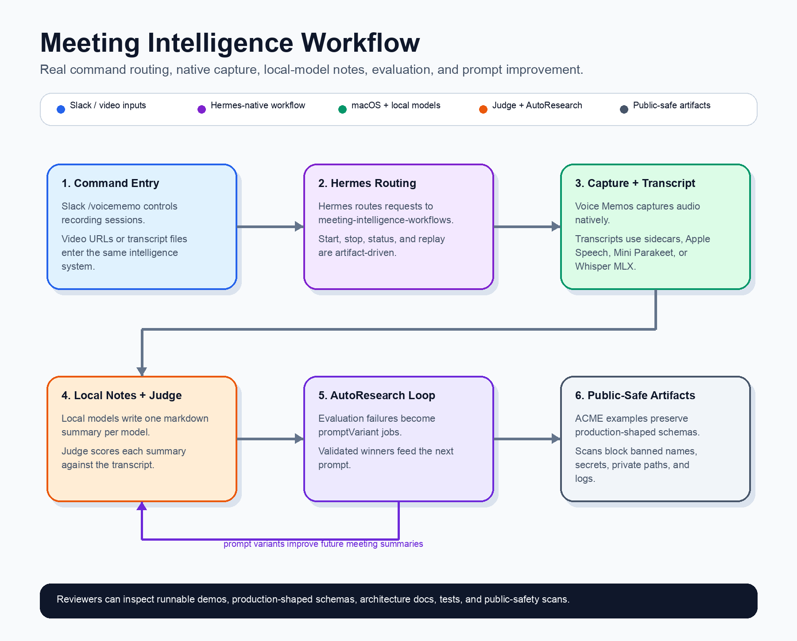

# Meeting Intelligence Pipelines

Meeting Intelligence Pipelines is a sanitized engineering case study of a production-style AI workflow: Slack `/voicememo` and `video-summarize` inputs flow through Hermes, native macOS capture/transcription, local-model summarization, and Judge evaluation, then AutoResearch mines weak notes and promotes prompt variants that improve future summaries. It shows the engineering behind applied AI automation: reproducible artifacts, local inference, evaluation loops, and public-safe release gates.



All private client names, transcripts, audio, secrets, logs, and local operator details have been removed or replaced with ACME examples.

## What This Shows

- Real `/voicememo` workflow shape: Slack command, Hermes `meeting-intelligence-workflows`, native voice memo controls, macOS Voice Memos, transcript extraction, dual summary branches, metadata, and judge artifacts.
- Real `video-summarize` workflow shape: media ingestion, transcription, chunked summarization, sanitized note sheets, and deterministic rendering.
- Real AutoResearch workflow shape: evaluated recording folders become `promptVariant` jobs, jobs produce `summary.json`, proposal-ready runs emit `proposal.json`, and prompt changes are promoted only after validation improvement with no regressions.
- Public-safety workflow: tracked files are scanned for banned client terms, secret-like strings, private home paths, and private log filenames before publishing.

## Quick Start

```bash
python3 scripts/run_full_demo.py
python3 -m unittest discover -s tests -v
python3 scripts/public_safety_scan.py --term "$BANNED_TERM"
```

The full demo writes generated artifacts to `outputs/`, which is intentionally git-ignored.

## Repository Layout

```text
docs/                  Architecture and pipeline notes
examples/              Synthetic transcripts and eval cases
scripts/               CLI entry points and public-safety scanner
src/meeting_intelligence/  Reusable pipeline code
tests/                 Unit tests for demos and safety checks
```

## Demo Commands

Run the voice memo style pipeline:

```bash
PYTHONPATH=src python3 scripts/run_voice_memo_demo.py \
  --transcript examples/transcripts/team_sync.txt \
  --out outputs/voice-memo-demo.md
```

Run the video summary style pipeline:

```bash
PYTHONPATH=src python3 scripts/run_video_summary_demo.py \
  --transcript examples/transcripts/product_walkthrough.txt \
  --title "Product Walkthrough" \
  --out outputs/video-summary-demo.md
```

Replay the sanitized real-workflow artifact chain:

```bash
PYTHONPATH=src python3 scripts/replay_pipeline.py
```

Run the AutoResearch prompt-variant demo:

```bash
PYTHONPATH=src python3 scripts/run_autoresearch_demo.py \
  --cases examples/autoresearch/evaluation_cases.json \
  --out outputs/autoresearch-report.json \
  --markdown-out outputs/autoresearch-report.md
```

Run everything:

```bash
PYTHONPATH=src python3 scripts/run_full_demo.py
```

## What Is Real vs Synthetic

Real system surfaces represented here:

- Slack `/voicememo` routes through Hermes and the `meeting-intelligence-workflows` Slack runner.
- The Slack runner calls the migrated native workflow bundle instead of faking the flow inside Slack.
- Native macOS Voice Memos is the capture surface.
- The stop path calls the dual summary pipeline and records `channel`, `source`, `pipelineType`, `summaryModel`, `summaryFile`, and `summaryArtifacts`.
- Model-specific summaries are evaluated by a judge route and written as `summary-evaluation.json` / `.md`.
- AutoResearch jobs use `promptVariant`, train/validation splits, promotion policy, and proposal artifacts.

Synthetic parts:

- ACME transcripts and summaries are invented.
- Audio is intentionally omitted.
- Sanitized artifacts preserve schema and lifecycle but not private content.
- Demo scripts replay artifacts locally instead of contacting Slack, macOS apps, or model servers.

## Public-Safety Checks

Run the scanner before publishing:

```bash
python3 scripts/public_safety_scan.py --term "$BANNED_TERM"
```

The scanner checks project files for banned terms supplied at runtime and common secret-like patterns. It avoids hard-coding private client names into the repository itself.

## Key Docs

- [Real Workflow](docs/real-workflow.md)
- [AutoResearch Real Loop](docs/autoresearch-real-loop.md)
- [Video Summarize Pipeline](docs/video-summarize.md)
- [Sanitized Artifacts](examples/sanitized-artifacts/README.md)

## Engineering Notes

The code is intentionally compact and dependency-free, but the artifact schemas and lifecycle names mirror the production workflow. The purpose is to let reviewers inspect the engineering design without exposing private data or needing private infrastructure.
