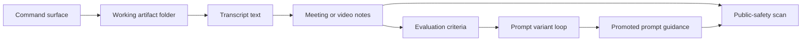

# Architecture

This repo models three related pipelines with synthetic data and deterministic local code.

## System Map

## Design Principles

- Preserve raw source artifacts separately from generated notes.
- Keep transcript chunking explicit so long inputs are not silently truncated.
- Render final summaries from structured notes instead of relying on a fragile final merge.
- Treat evaluation as a first-class pipeline output, not a manual afterthought.
- Keep public artifacts synthetic and scan them before publishing.

## Public Repo Boundary

This repository does not include private recordings, raw transcripts, live configs, secrets, logs, or customer-specific labels. The examples are invented to demonstrate the engineering pattern.
