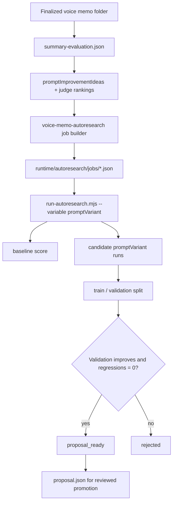

# AutoResearch Real Loop

This repo includes sanitized excerpts of the actual prompt-improvement workflow used after voice memo summaries are evaluated.

## Lifecycle



## What Feeds The Job

The voice memo AutoResearch builder scans evaluated recording folders and turns each one into a test input:

- `transcript` from the finalized recording.
- `prompt` built from the voice memo summary contract.
- `context` containing the recent judge winner, rankings, and prompt improvement ideas.
- criteria that penalize invented owners, invented dates, missed blockers, vague key points, and broken section contracts.

## Prompt Variant That Won

The sanitized proposal shows the same kind of improvement that worked in the real workflow:

```text
voice-memo-detail-ownership-guard
```

The useful pattern is:

- preserve named systems and exact objects
- preserve owners and dates when explicitly stated
- preserve blockers and data dependencies
- separate confirmed facts from tentative discussion
- use `Owner unclear` instead of guessing
- avoid generic team assignments

## Sanitized Result Excerpt

`examples/sanitized-artifacts/autoresearch/voice-memo-summary-qwen3.6-27b-q5_K_M.summary.json` preserves the production result shape:

- `status`: `proposal_ready`
- `variable`: `promptVariant`
- `baseline.validationMean`: `0.5`
- `bestCandidate.value.label`: `voice-memo-detail-ownership-guard`
- `bestCandidate.validationMean`: `0.75`
- `promotion.validationDelta`: `0.25`
- `promotion.validationRegressions`: `0`

The numbers are sanitized, but the artifact schema and decision rule mirror the real system.
