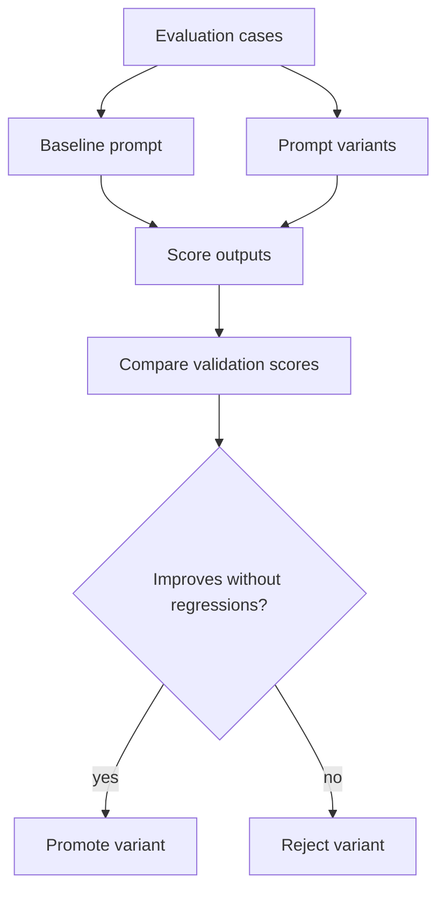

# AutoResearch Loop

For the real case-study flow, start with [AutoResearch Real Loop](autoresearch-real-loop.md). This page documents the small local evaluator used for fast tests in this public repo.



## Demo

```bash
PYTHONPATH=src python3 scripts/run_autoresearch_demo.py
```

The local evaluator checks three prompt variants:

- `baseline`: a deliberately weak meeting summary.
- `detail-ownership-guard`: preserves owners, dates, blockers, named objects, and uncertainty.
- `compact-executive`: short recap with fewer operational details.

## Why This Matters

Meeting notes are only useful when they preserve the operational details that drive follow-up work: owners, dates, decisions, blockers, numbers, and dependencies. The loop in this repo makes those expectations measurable and promotes the variant that performs best on validation cases.
