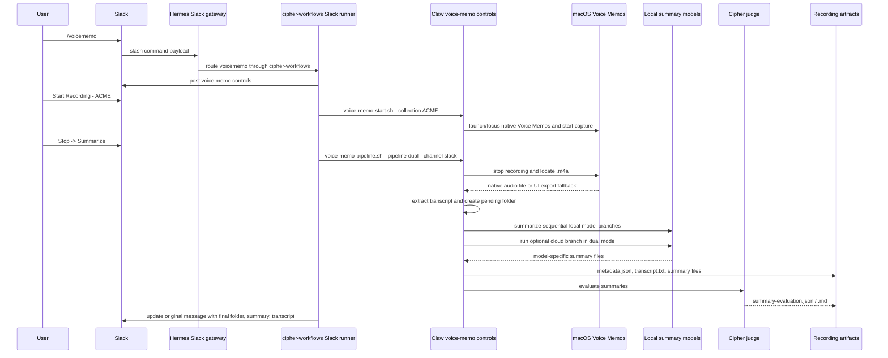

# Real Workflow

This is the sanitized shape of the production workflow. Private names are replaced with ACME and private artifacts are omitted.

## Slack To Native Voice Memo

## Important Runtime Details

- Slack commands are handled by the Hermes gateway and routed through the `cipher-workflows` plugin.
- Slack `/voicememo` uses a Slack-native runner instead of Telegram bridge semantics.
- The runner posts or updates Slack control messages and calls the Claw voice memo scripts.
- Start calls the native voice memo start script with a collection. In this repo the private collection name is sanitized to `ACME`.
- Stop calls `voice-memo-pipeline.sh --pipeline dual --channel slack --source slack-voicememo-controls`.
- The native macOS Voice Memos app writes audio under the Voice Memos group container. If direct detection fails, the production scripts attempt a UI export fallback.
- Transcript extraction first tries the Voice Memos transcript sidecar path and then falls back to the compiled Apple Speech transcriber.
- The pipeline writes a pending folder, extracts `transcript.txt`, then runs the summary branches.
- `dual` mode writes local model outputs and a cloud output when they succeed.
- Local model branches run sequentially so the machine does not load every local model at once.
- `metadata.json` records `channel`, `collection`, `source`, `pipelineType`, delivered `summaryModel`, delivered `summaryFile`, and `summaryArtifacts`.
- The summary evaluator compares model-specific summaries against the transcript and writes `summary-evaluation.json` plus `summary-evaluation.md`.

## Artifact Contract

The final recording folder contains:

- `transcript.txt`
- `metadata.json`
- one or more `[model] summary.md` files
- `summary-evaluation.json`
- `summary-evaluation.md`

The sanitized example in `examples/sanitized-artifacts/voice-memo-recording/` keeps that shape without publishing audio, private transcripts, secrets, or logs.
