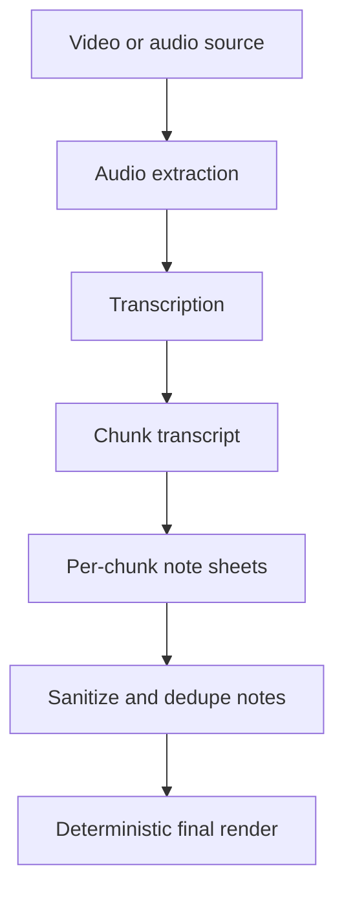

# Video Summarize Pipeline

The video summarization workflow demonstrates the shape of a URL or media transcript pipeline without requiring a live downloader or model endpoint.



## Demo

```bash
PYTHONPATH=src python3 scripts/run_video_summary_demo.py
```

The demo reads a synthetic transcript and writes a final video summary into `outputs/`.

## Production Pattern Represented

- Source download and transcription are separate stages.
- Chunking keeps large transcripts within model context limits.
- Each chunk produces structured notes.
- The final summary is rendered locally from parsed notes.
- The pipeline can be backed by local inference or an OpenAI-compatible model service.
