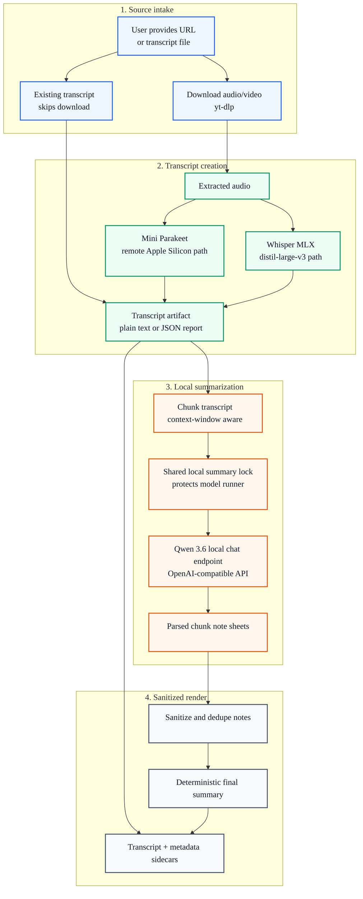

# Video Summarize Pipeline

This page documents the sanitized shape of the real `video-summarize` workflow. The local demo uses a synthetic transcript, but the diagram mirrors the production path: media ingestion, transcription, chunked local summarization, parsed note sheets, and deterministic final rendering.



## Demo

```bash
PYTHONPATH=src python3 scripts/run_video_summary_demo.py
```

The demo reads a synthetic transcript and writes a final video summary into `outputs/`.

## Real Workflow Shape

- URL/media sources are downloaded with `yt-dlp`; existing transcript files skip the download and transcription stages.
- Transcription is provider-routed: the fast path uses Mini Parakeet, while the local fallback uses Whisper MLX with `distil-large-v3`.
- The summarizer sends transcript chunks to a local OpenAI-compatible endpoint, with Qwen 3.6 as the represented production model family.
- Chunk sizing is context-window aware so long videos are not silently truncated.
- A shared local summary lock prevents overlapping video, stock-update, and meeting-summary jobs from overloading the same local model runner.
- Each chunk returns a structured note sheet. The final summary is rendered locally from parsed notes instead of relying on a second fragile merge prompt.
- The public demo preserves the artifact lifecycle with synthetic data and never contacts private model services or private source URLs.
