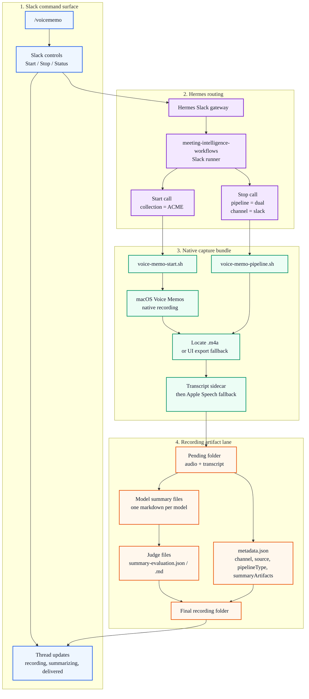

# Voice Memo Pipeline

This page documents the sanitized shape of the real Slack-triggered voice memo workflow. The local demo stays transcript-only, but the production-shaped diagram shows the actual command route, native macOS capture path, transcript extraction, summary branches, Judge output, and artifact contract.



## Demo

```bash
PYTHONPATH=src python3 scripts/run_voice_memo_demo.py
```

The demo reads `examples/transcripts/team_sync.txt` and writes `outputs/voice-memo-demo.md`.

## Real Workflow Shape

- Slack `/voicememo` is the front door. The Hermes Slack gateway routes the command to `meeting-intelligence-workflows`.
- Start and stop are separate native calls so the Slack control surface can manage a live recording session.
- The capture layer uses the native macOS Voice Memos app instead of a web recorder.
- The stop path runs the dual pipeline, extracts the audio artifact, finds or builds `transcript.txt`, and stages a pending recording folder.
- Summary branches write one model-specific markdown file each. The Judge compares those files against the transcript and emits `summary-evaluation.json` plus `summary-evaluation.md`.
- `metadata.json` records the production-shaped routing fields: `channel`, `collection`, `source`, `pipelineType`, delivered `summaryModel`, delivered `summaryFile`, and `summaryArtifacts`.
- The public demo preserves note structure and artifact naming with synthetic transcript content; it does not call Slack, macOS Voice Memos, private model endpoints, or private logs.
