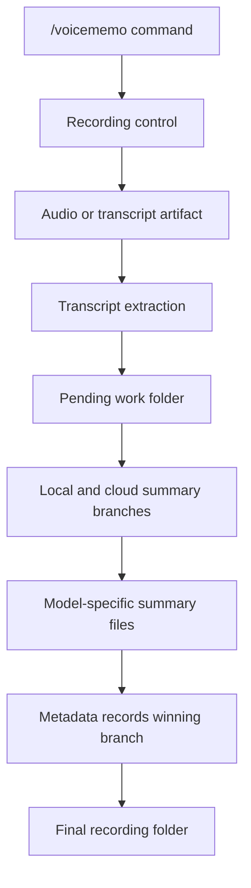

# Voice Memo Pipeline

For the real case-study flow, start with [Real Workflow](real-workflow.md). This page documents the lightweight transcript-only demo kept for local testing.



## Demo

```bash
PYTHONPATH=src python3 scripts/run_voice_memo_demo.py
```

The demo reads `examples/transcripts/team_sync.txt` and writes `outputs/voice-memo-demo.md`.

## Production Pattern Represented

- Command-triggered workflow.
- Transcript and summaries saved as separate artifacts.
- Summary output uses consistent sections: summary, key points, decisions, risks, next steps, and open questions.
- Owners and dates are preserved when explicitly stated.
- Unclear items remain open questions instead of being converted into false decisions.
